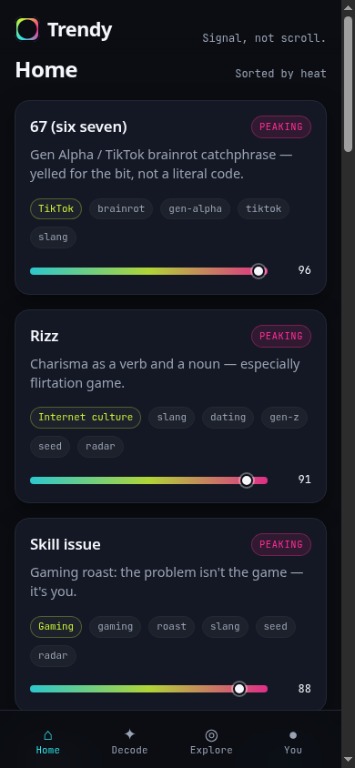
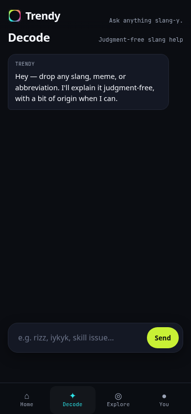

# Trendy

**Trendy** is a Python CLI and MCP interface for AI tools. Agents decode slang and memes, list hot trends, and check Trend Radar (`decode`, `trends`, `radar`) against one lexicon. The phone PWA (and the iOS app) is a client on that same data — not the only product. Judgment-free on purpose: catch up without the scroll, including for people who don’t want FOMO and for older users who want slang context.

Slang and meme entries can carry a rough **age band** (Gen Alpha, Gen Z, Millennial, Gen X+, Mixed) so Decode can say who mainly uses a term. See [`docs/age-demographics.md`](docs/age-demographics.md).

> **License:** MIT · Copyright (c) 2026 bluenightlightpup  
> **GitHub:** https://github.com/bluenightlightpup/trendy  
> **Workbench (agents/skills):** [my-workbench](https://github.com/bluenightlightpup/my-workbench) — this app repo is separate; do not clone the workbench into here.

## Product snapshot

| Tab | Role |
|-----|------|
| **Home** | Trend feed sorted by momentum; **heat meter** (cool → volt → hot) on every card; tap for origin story |
| **Decode** | AI chat (Claude) explaining slang / memes / abbreviations — judgment-free |
| **Explore** | Vast niche browse (TikTok → Money) — catch up without the scroll; Radar keeps slang fresh |
| **You** | Interest toggles, digest frequency, **New here mode** |

Save / follow trends: **live in the PWA** (localStorage); iOS stub + TestFlight pending Mac.

Design identity (“signal”): deep ink background; hot pink / acid-lime / cyan temperature scale; Space Grotesk + JetBrains Mono vibe (system fallbacks OK initially). See `docs/design-tokens.md`.

## App preview





## Roadmap phases

| Phase | Focus | Status |
|-------|--------|--------|
| **P0** | PRD, repo, backlog | Done |
| **P1** | SwiftUI shell, Home heat feed, Explore | Done (XcodeGen on Mac) |
| **P2** | Decode + You + APIs | PWA Decode/You live; iOS Claude API next |
| **P3** | Save/follow, polish, TestFlight | Partially done (PWA save/follow + polish; TestFlight pending Mac) |
| **Radar** | 24/7 multi-platform ingest | Live (TikTok/IG stubs) |
| **P4** | CLI + MCP for integrated AI tools | **CLI GO** (spike); **MCP next** (Python stdio, not hosted) |
| **P5** | Landscape (Urban Dictionary & peers) + novelty uses | Open — research |

Details: [`docs/phased-implementation.md`](docs/phased-implementation.md) · tickets in [`docs/backlog.md`](docs/backlog.md).

## Phase 4 — CLI & MCP for integrated AI tools

**Decision (2026-09-14, updated 2026-10-03):** **CLI GO**. **MCP is next**, no longer deferred: a local Python stdio server beside the CLI (same functions agents already shell out to). No hosted remote MCP yet.

- Design brief: [`docs/cli-mcp-integration.md`](docs/cli-mcp-integration.md)
- ADR: [`docs/adr/0001-cli-mcp.md`](docs/adr/0001-cli-mcp.md)
- Tickets: **T0019** ✓ · **T0020** CLI spike ✓ · **T0021** MCP next (stdio; not built this pass)

### Trendy CLI (spike)

Stdlib Python; reads `web/data` and can invoke Radar. From repo root:

```bash
python cli/trendy.py decode 67
python cli/trendy.py trends --min-heat 0.7 --limit 20
python cli/trendy.py trends --world TikTok --limit 10
python cli/trendy.py radar status
python cli/trendy.py radar run
# optional pass-through: python cli/trendy.py radar run -- --config radar/config.yaml
# also: python -m cli decode 67
```

Commands: `decode` (slang + abbreve lexicon), `trends`, `radar status`, `radar run` → `radar/run_ingest.py`.

### Live Decode proxy (model-on-miss)

Optional LAN proxy so the phone PWA can get live model meanings **only on lexicon misses** — API keys stay on the PC.

```bash
# Windows (PowerShell/cmd) or macOS/Linux — key in env, never in the browser
export OPENAI_API_KEY=sk-...   # or ANTHROPIC_API_KEY / TRENDY_* variants
python cli/trendy.py serve     # http://0.0.0.0:8787
# Phone You tab → Live Decode URL → http://<pc-lan-ip>:8787
python cli/trendy.py decode "niche phrase" --live
```

Docs: [`docs/live-decode.md`](docs/live-decode.md). Trusted LAN / personal use only.

### Community lexicon (suggest → consensus)

Weak Decode answers show **Suggest a better definition**. With the same LAN proxy, `POST /v1/suggest` builds consensus into `web/data/community-slang.json`. See [`docs/community-lexicon.md`](docs/community-lexicon.md).

## Phase 5 — Landscape & novelty *(research)*

Review slang translators (Urban Dictionary, Slangora, Wordyex, Musely, GenZ apps, general LLMs) and explore novel Trendy uses (family Decode, anti-FOMO digest, heat time machine, creator “am I late?”, agent briefs, …).

- Landscape: [`docs/product-landscape.md`](docs/product-landscape.md)
- Novelty bets: [`docs/novelty-use-cases.md`](docs/novelty-use-cases.md)
- Tickets: **T0022–T0024**


## Repo layout

```
App/                 SwiftUI source (create Xcode project via docs/xcode-setup.md)
web/                 Progressive Web App (static; try on phone without Xcode)
radar/               Trend Radar — continuous multi-platform ingest → web/data
cli/                 Trendy CLI spike (decode / trends / radar) — Phase 4
Tests/TrendyTests/   Unit test stubs
docs/                PRD, phases, backlog, architecture, design tokens, ideas, ADRs
.github/             Issue/PR templates + validate + radar-ingest cron
```

## Getting started (Xcode)

Source files live under `App/`. Generate the Xcode project on a Mac with [XcodeGen](https://github.com/yonaskolb/XcodeGen):

```bash
brew install xcodegen
xcodegen generate
open Trendy.xcodeproj
```

See **`docs/xcode-setup.md`** (aligned with workbench skill `ios-xcode-setup`) for details and a manual fallback.

Minimum iOS: **17.0** (documented in architecture).

## Docs map

| Doc | Purpose |
|-----|---------|
| `docs/prd.md` | Product requirements |
| `docs/backlog.md` | Numbered tickets (T0001+) |
| `docs/architecture.md` | App structure & boundaries |
| `docs/design-tokens.md` | Colors, type, heat scale |
| `docs/workbench.md` | How this repo uses my-workbench |
| `docs/xcode-setup.md` | Create Xcode project from this tree |
| `docs/ideas/` | Owner idea extracts (plain text) |
| `docs/radar.md` | Trend Radar continuous ingest (24/7 slang/trends) |
| `docs/age-demographics.md` | Optional age band on slang, trends, and Decode |
| `docs/cli-mcp-integration.md` | Phase 4 CLI/MCP (CLI GO; MCP next, Python stdio) |
| `docs/adr/0001-cli-mcp.md` | ADR: CLI first, MCP later |
| `docs/testflight.md` | TestFlight / App Store Connect checklist (Mac) |

## Sync note

Local idea path may be Desktop “trendy docs”; **this app repo is separate from my-workbench**. Agents/skills stay in the workbench; product code and app docs live here.


## Try on your phone

A static **Progressive Web App** lives in [`web/`](web/) — same tabs (Home, Decode, Explore, You), mock trends, and slang decoder. No Xcode required.

```bash
npx --yes serve web -l 4173
# or: python3 -m http.server 4173 --directory web
```

Open the URL on your phone (same Wi‑Fi), then Add to Home Screen. Details: [`web/README.md`](web/README.md).


## Trend Radar (continuous training)

Radar ingests public signals on a schedule, normalizes them across **all Explore niches**, and merges into `web/data/trends.json` + `web/data/slang.json` so Explore stays vast and fresh. See `docs/explore-niches.md`.

```bash
pip install -r radar/requirements.txt
python3 radar/run_ingest.py
```

- **LIVE now:** Reddit (public JSON), mock seed, best-effort YouTube RSS / Wikipedia.
- **STUB:** TikTok & Instagram (official APIs / partner feeds when you add keys — no ToS-violating scrapers).
- **Cron:** GitHub Actions every 2 hours UTC (`.github/workflows/radar-ingest.yml`).

Details: [`radar/README.md`](radar/README.md) · [`docs/radar.md`](docs/radar.md).

## Contributing

See `CONTRIBUTING.md`. Use workbench skills (`git-branch-pr`, `software-dev-loop`, etc.). Security: `SECURITY.md`. Owner: `@bluenightlightpup` (`CODEOWNERS`).
